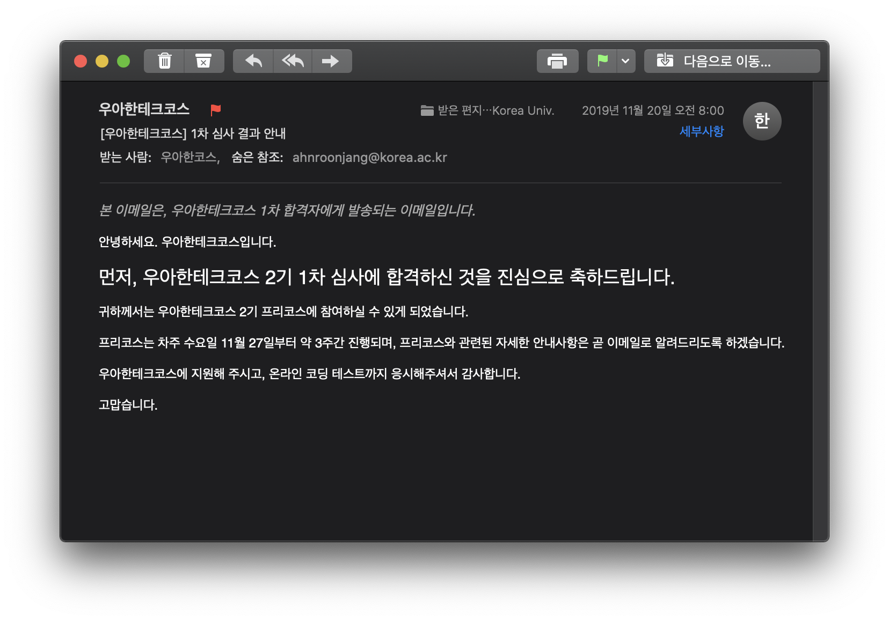

# 프리코스 - 지원

[우아한형제들](https://www.woowahan.com/)에서 백엔드 개발자 양성을 위해 무상교육을 해주는 [우아한테크코스](https://woowacourse.github.io/)(이하 우테코) 2기가 열린다고 해서 지원했다.

### 1차 서류전형

1차 서류 문항은 다음과 같았다.

1. 지금까지의 프로그래밍 학습과정과 역량
2. 프로그래머가 되려는 이유
3. 몰입에 관련된 경험
4. 지원동기

사실 나머지는 솔직하게 그냥 쓰면 되는 것들이라 상관없었는데, 1번 문항 같은 경우는 처음에 고민을 좀 했다. 다른 기업 자기소개서를 쓸 때처럼 살짝 무리해서라도 역량을 부풀려 뽐내야하는지 고민하다 우테코 홈페이지의 교육대상을 읽고 결정했다.

> 최소한의 프로그래밍 역량이 있어야 합니다. 함수, 변수, 데이터 타입, 조건문, 반복문을 활용해 프로그래밍 구현이 가능해야 합니다. 하나 이상의 기능을 가진 작은 애플리케이션으로 300라인 정도의 구현이 가능해야 합니다.

그래서 그냥 지금까지 해왔던 그대로 JavaScript와 Python, 그리고 MERN Stack 기초 정도를 할 줄 안다고 솔직하게 적었다.

### 온라인 코딩 테스트

온라인 코딩 테스트는 토요일 오전에 [프로그래머스](https://programmers.co.kr/)에서 진행됐다. 영국에서 여행 중이었어서 하루를 통째로 빼고 새벽에 호텔방에서 열심히 풀었다.

지금까지 내가 봤던 코딩테스트는 다음과 같다.

* 카카오 2018 블라인드 채용 (탈)
* 네이버 2019 캠퍼스핵데이 (합)

그런데 사실 놀랐던건, 지금까지 봤던 코딩테스트에 비해 난이도는 평이했다는 것이다. (물론 5번까지만...) 그리고 문제를 풀면서 새벽에 피곤했음에도 불구하고 사실 내용이 재밌었다. 특히 족발만 먹는 커플이 족발을 만들어 먹기 위해 재료를 사러가는 여정(?)에 관하나 문제가 있었는데, 문제 자체는 조건문과 반복문을 사용하면 되는, 의외로 꽤 단순한 문제였다.

물론, 5번까지 문제를 쉽게쉽게 풀고, 6번과 7번에 전체 시간의 70% 정도를 날리고, 결국 두 문제는 해결하지 못했다.

### 1차 전형 합격자 발표

사실 내가 왜 붙었는지는 모르지만, 코딩 테스트의 부족함을 열정 넘치는 자기소개서에서 점수를 메꿔주신게 아닐까싶다. 인터넷에서 코딩 테스트 커트라인이 6\~7문제라는 찌라시들도 보면서 가슴 졸였는데, 기분 좋게 붙었다.

이제 3주간 프리코스 준비를 해야한다. 아직 교환학생으로 핀란드에 와 있어서 혹시라도 오프라인 면접이나 OT같은 것이 있으면 큰일날뻔 했는데, 이제 맘 편히 Java 공부부터 시작하면 될 것 같다. 지금까지 제대로 해보지 못한 백엔드 개발이지만 어쩌면 또 운명처럼 만나게 되지 않을까 하는 희망을 품고서...!

다음 글부터는 프리코스를 준비하고 진행하며 배운 점들에 대해 정리해볼까 한다.
