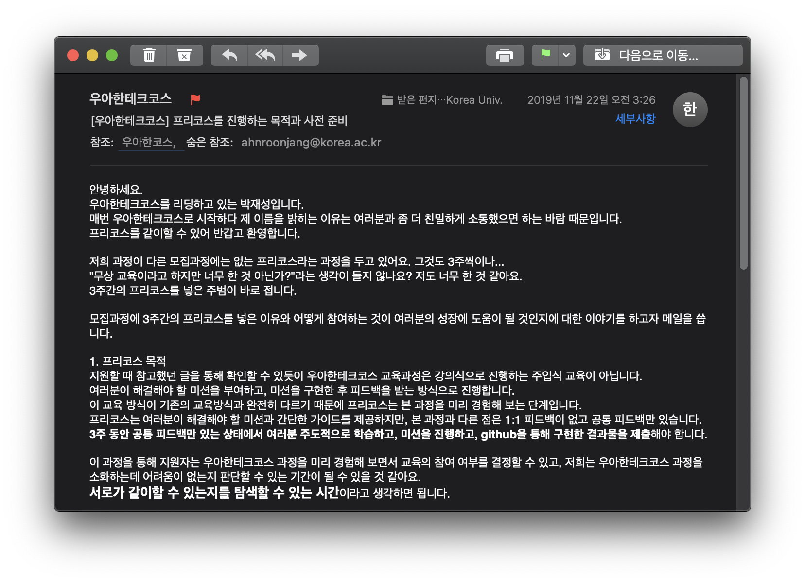

# 프리코스 - 준비



Java 교육에 있어 유명하신 자바지기 박재성님께서 친히 메일을 보내주셨는데, 눈에 띈 것은 모든 학습이 **100% 주도적**으로 이뤄져야한다는 것이었다.

### 주도적 학습에 대한 잡생각

주도적 학습을 보니 생각나는게 있다. 나는 멋쟁이사자처럼에서 고려대학교 학생들을 가르쳤었는데, 교안을 준비하고 매주 3시간씩 두 번의 강의를 진행했었다. 우리 학교 학생들이 상대적으로 우수하다는(?) 생각이 있었는데, 사실 그 이유를 굳이 꼽아본다면 중앙 멋쟁이사자처럼 커리큘럼과 제일 크게 다른 점은 사실 과제량에 있었다.

나는 독학으로 프로그래밍을 배우는 과정에서 이상적인 학습방법을 다음과 같이 생각했었다.

1. 개념 강의를 듣는다.
2. 강의를 들을 때 코드를 **무조건** 따라 쳐본다. (이 경우 강사가 코드를 칠 시간을 충분히 줘야 한다.)
3. 강의 종료 후 교안을 보며 코드를 한 번 더 쳐본다.
4. 교안과 별개로 학습내용을 복습할 수 있는 과제를 추가로 해본다.

이는 비전공자로만 이루어진 학생들을 가르칠 때 있어 중도 포기를 어느정도 예방하기 위해 생각해낸 방법이었다.

그런데 박재성님께서 쓰신 [목적의식 있는 연습을 통한 효과적인 학습](http://woowabros.github.io/techcourse/2019/05/02/techcourse.html)을 읽으며 **100% 주도적**인 학습에 대해 생각해보게 되었다.

내가 가르치던 학생들과 제일 큰 차이점은 아무래도 **합격하고 싶은 동기부여** 일 것 같은데, 나중에 교육자로서 다른 강의를 설계할 때 꼭 한 번 적용해보고 싶다는 생각이 들었다.

### 지난 기수 프리코스 프로그래밍 요구사항 정리

잡담이 쓸데없이 길었다. 본론으로 들어가서, 메일로 첫번째 과제를 받았는데 1기 프리코스의 첫 번째 과제와 같은 **숫자야구게임** 구현 주제였다. 지난 기수와 제일 큰 차이점은 이미 프리코스 일련의 과정들에 대해 피드백들이 존재하는 것이기 때문에 1기 프리코스의 프로그래밍 요구사항들을 정리해봤다.

#### 프로그래밍 요구사항 (1\~3주)

* **Java 코드 컨벤션을 지키면서 프로그래밍**한다.
  * [Google Java Style Guide](https://google.github.io/styleguide/javaguide.html)
  * [Oracle Code Convetions for Java 번역](http://kwangshin.pe.kr/blog/java-code-conventions-%EC%9E%90%EB%B0%94-%EC%BD%94%EB%94%A9-%EA%B7%9C%EC%B9%99/?ckattempt=1)
  * **(추가) 2019. 12. 4.** [네이버 캠퍼스 핵데이 Java 코딩 컨벤션](https://naver.github.io/hackday-conventions-java/)
* **indent depth를 1까지만 허용**한다.
  * 예를 들어 `while`문 안에 `if`문이 있으면 depth는 2다.
  * 힌트: 함수/메소드를 분리하라.
  * **최대한 1을 유지하기 위해 노력하고, 정말 힘든 경우 2까지 허용**한다.
* **함수/메소드의 길이가 10라인을 넘어가지 않도록 구현**한다.
  * 함수/메소드가 한 가지 일만 잘 하도록 구현한다.
  * 주석은 가능하면 함수 밖 또는 코드 우측에 추가하는 방식으로 구현한다.
  * 공백 라인도 한 라인에 해당한다.
* 함수/메소드의 인자 수를 3개까지만 허용한다. 4개 이상은 허용하지 않는다.
* **`else` 예약어를 쓰지 않는다.**
  * 힌트: `if` 조건절에서 값을 `return` 하면 `else`를 사용하지 않아도 된다.
  * `switch`/`case`도 허용하지 않는다.
* `public`/`protected`/`private`/`package` 접근 제어자를 용도에 적합하게 사용해 구현한다.

#### 피드백 (1\~3주)

* **이름을 통해 의도를 드러내라.**
  * 변수 이름, 함수/메소드 이름, 클래스 이름을 짓는데 시간을 투자하라.
  *   이름을 통해 변수의 역할, 함수의 역할, 클래스의 역할에 대한 의도를 드러내기

      위해 노력하라.
  * 연속적인 숫자를 덧붙인 이름(a1, a2, ..., aN) 덧붙이거나 불용어(Info, Data, a, an, the)를 추가하는 방식은 적절하지 못하다.
* **축약하지 마라.**
  * 의도를 드러낼 수 있다면 이름이 길어져도 괜찮다.
* **개발 도구의 code format 기능을 활용해라.**
  * IntelliJ 또는 Eclipse의 formatting 기능을 활용한다.
  * IntelliJ 단축키는 Ctrl+Alt+L(윈도우), Cmd+Alt+L(맥)
* **space(공백)도 convention이다.**
  * `for`, `while`, `if`문 사이의 space도 convention이다.
* **불필요하게 공백 라인을 만들지 않는다.**
  * 공백 라인을 띄우는 것도 코드상에 문맥이 달라지는 부분에 의도를 가지고 띄우면 좋겠다.
* **반복하지 마라.**
  * 중복은 소프트웨어에서 모든 악의 근원이다.
* **space vs tab 혼용**
  * 들여쓰기에 space와 tab을 혼용하지 않는다. (둘 중에 하나만 사용한다.)
* **의미없는 주석을 달지 않는다.**
  * 변수 이름, 함수(메소드) 이름을 통해 어떤 의도인지가 드러난다면 굳이 주석을 달지 않는다.
  * 모든 변수와 함수에 주석을 달기보다 가능하면 이름을 통해 의도를 드러내고, 의도를 드러내기 힘든 경우 주석을 다는 연습을 한다.
* **값을 하드코딩하지 마라.**
  * 문자열 숫자 등의 값을 하드코딩하지 마라.
  * 상수(static final)를 만들고 이름을 부여해 이 변수의 역할이 무엇인지 의도를드러내라.
  * 구글에서 "java 상수"와 같은 키워드로 검색해 상수 구현 방법을 학습하고 적용해 본다.
  * 자동차 경주 게임에서 이동/정지 기준인 4, Random 생성 기준이라 할 수 있는 10 등이 상수로 구현할 수 있는 대표적인 예다
* **git commit 메시지를 의미있게 작성**
  * commit 메시지에 해당 commit에서 작업한 내용에 대한 이해가 가능하도록 작성한다.
* **기능 목록 업데이트**
  * README.md 파일에 작성하는 기능 목록은 기능 구현을 하면서 변경될 수 있다.
  * 시작할 때 모든 기능 목록을 완벽하게 정리해야 한다는 부담을 가지기 보다 기능을 구현하면서 문서를 계속 업데이트한다.
  * 죽은 문서가 아니라 살아있는 문서를 만들기 위해 노력한다.
* **README.md를 상세히 작성**
  * 미션 저장소의 README.md는 소스코드에 앞서 해당 프로젝트가 어떠한 프로젝트인지 마크다운으로 작성하여 소개하는 문서이다.
  * 해당 프로젝트가 어떠한 프로젝트이며, 어떤 기능을 담고 있는지 기술하기 위해서 마크다운 문법을 검색해서 학습해보고 적용해 본다.
* **기능 목록 구현을 재검토한다.**
  * 기능 목록을 클래스 설계와 구현, 함수(메소드) 설계와 구현과 같이 너무 상세하게 작성하지 않는다.
  * 클래스 이름, 함수(메소드) input/output은 언제든지 변경될 수 있기 때문이다. 너무 세세한 부분까지 정리하기 보다 구현해야할 기능 목록을 정리하는데 집중한다.
  * **정상적인 경우도 중요하지만 예외적인 상황도 기능 목록에 정리**한다.
  * 특히 예외 상황은 시작단계에서 모두 찾기 힘들기 때문에 기능을 구현하면서 계속해서 추가해 나간다.
  *   작성 예시

      ```
      - 사용자가 입력한 이름을 쉼표 기준으로 분리해야 한다.
      - 사용자 이름이 5자 이하인지 검증해야 한다.
      - 자동차는 4이상인 경우 전진한다.
      - 자동차는 4미만인 경우 정지한다.
      - 0 ~ 9 사이의 임의의 값을 생성한다.
      - 여러 대의 자동차 중 최대 위치 값을 구한다.
      - 최대 위치 값에 해당하는 자동차 목록을 구한다.
      - ...
      ```
*   **구현 순서도 convention이다.**

    * 클래스의 구현 순서에 대한 convention을 지키는 것도 읽기 좋은 코드를 구현하는데 의미가 있다.
    * 클래스의 구현 순서를 지키면서 프로그래밍한다.

    ```java
    class A {
        상수(static final) 또는 클래스 변수
        인스턴스 변수
        생성자
        메소드
    }
    ```
* **Java API를 적극 활용한다.**
  * 메소드를 직접 구현하기 전에 Java API에서 제공하는 기능인지 검색을 먼저 해 본다.
  * Java API에서 제공하는 않을 경우 직접 구현한다.
*   **적절한 collection을 활용하라.**

    * 일차로 `List`, `Set`, `Map`을 적절하게 활용한다.
    * 적절한 자료구조가 없다면 나만의 자료구조를 구현한다.
      * 나만의 클래스를 추가하는 것 == 나만의 자료구조
    * Java collection 자료구조(`List`, `Set`, `Map` 등)를 사용하면 데이터를 조작할 때 다양한 api를 사용할 수 있다.
    * 예를 들어 `List<String>` 에 `"pobi"`라는 값이 포함되어 있는지는 다음과 같이 확인할 수 있다.

    ```java
    List<String> winners = Arrays.asList("pobi", "jason");
    boolean result = winners.contains("pobi");
    ```

    * 6개의 서로 다른 값을 가지는지 확인 (`List`대신 `Set`을 사용해 구현 가능함)

    ```java
    public class Lotto {
        private static final int LOTTO_SIZE = 6;
        private final Set<LottoNumber> lotto;
        private Lotto(Set<LottoNumber> lotto) {
            if (lotto.size() != LOTTO_SIZE) {
                throw new IllegalArgumentException  ("로또는 6개의 서로 다른 숫자를 입력해야 합니다.")  ;
            }
            this.lotto = lotto;
        }
    }
    ```

    * 각 등수별 당첨된 로또 수 (`Map`을 통해 구현 가능함)

    ```java
    public class LottoResult {
        private Map<Rank, Integer> result = new HashMap<>();
        public LottoResult() {
            for (Rank rank : Rank.values()) {
                result.put(rank, 0);
            }
        }
        public void putRank(Rank rank) {
            result.put(rank, result.get(rank) + 1);
        }
    }
    ```
*   **객체에 메시지를 보내라.**

    * 상태 데이터를 가지는 객체에서 데이터를 꺼내려(get)하지 말고 객체에 메시지를 보내라.
    * 예를 들어 Car가 우승자인지를 판단하기 위해 최대 이동 거리 값을 가지는 Car인지 판단 기능은?

    ```java
    // 틀린 예
    private boolean isMaxPosition(Car car) {
        return car.getPosition() == maxDistance;
    }

    // 좋은 예
    car.isMaxPosition(maxDistance);
    ```

    * 당첨번호와 사용자 구매로또 비교 로직: 다음과 같이 메시지를 보내는 경우 Lotto의 6개 숫자 값을 꺼내지 않아도 된다.

    ```java
    public class WinningLotto {
        private final Lotto lotto;
        private final int bonusNo;

        public WinningLotto(Lotto lotto, int bonusNo) {
            this.lotto = lotto;
            this.bonusNo = bonusNo;
        }

        public Rank match(Lotto userLotto) {
            int countOfMatch = userLotto.countOfMatch(lotto);
            boolean matchBonus = userLotto.isContains(bonusNo);
            return Rank.valueOf(countOfMatch, matchBonus);
        }
    }

    public class Lotto {
        [...]

        int countOfMatch(Lotto lotto) {
            int countOfMatch = 0;
            for (Integer number : numbers) {
                countOfMatch += getMatchingCount(lotto, number);
            }
            return countOfMatch;
        }

        private int getMatchingCount(Lotto lotto, Integer number) {
            if (lotto.isContains(number)) {
                return 1;
            }
            return 0;
        }

        boolean isContains(int bonusNo) {
            return numbers.contains(bonusNo);
        }
    }
    ```

    * 각 등수별 당첨금 계산하기: enum에서도 값을 꺼내지(get) 말고 메시지를 보내 로직을 구현한다.

    ```java
    public enum Rank {
        FIRST(6, 2_000_000_000), // 1등
        SECOND(5, 30_000_000), // 2등
        THIRD(5, 1_500_000), // 3등
        FOURTH(4, 50_000), // 4등
        FIFTH(3, 5_000), // 5등
        MISS(0, 0);

        private int countOfMatch;
        private int winningMoney;

        private Rank(int countOfMatch, int winningMoney) {
            this.countOfMatch = countOfMatch;
            this.winningMoney = winningMoney;
        }

        public long prize(int countOfMatchLotto) {
            return countOfMatchLotto * winningMoney;
        }

        [...]
    }
    ```
*   **필드(인스턴스 변수)의 수를 줄이기 위해 노력한다.**

    * 필드(인스턴스 변수)의 수가 많은 것은 객체의 복잡도를 높이고, 버그 발생 가능성을 높일 수 있다.
    * 필드(인스턴스 변수)에 중복이 있거나, 불필요한 필드가 없는지 확인해 필드의 수를 최소화한다.
    * 예를 들어 우승자를 구하는 다음 객체를 보자.

    ```java
    public class Winner {
        private List<Car> cars;
        private List<String> winnerList;
        private int maxDistance;
    }
    ```

    * 위 객체의 maxDistance와 winnerList는 자동차 목록(cars)만 있어도 모두 구할 수 있는 값이다. 따라서 위 객체는 다음과 같이 하나의 인스턴스 변수만으로 구현할 수 있다.

    ```java
    public class Winner {
        private List<Car> cars;
        private int getMaxDistance() { ... }
        public List<String> getWinners() { ... }
    }
    ```
*   **비즈니스 로직과 UI 로직을 분리해라.**

    * 비즈니스 로직과 UI 로직을 한 클래스가 담당하지 않도록 한다. 단일 책임의 원칙에도 위배된다.
    * 현재 객체 상태를 보기 위한 성격이라면 `toString()`을 통해 구현한다.
    * View에서 사용할 데이터라면 `getter` 메소드를 통해 데이터를 전달한다.

    ```java
    public class Car {
        private int position;

        // 비즈니스 로직
        public void move(int randomValue) {}

        // UI 로
        public void print(int position) {}
    ```
* **utf‑8 인코딩**
  * 인코딩을 utf‑8로 구현한다.
* **commit 메시지에 "#번호"를 추가하지 않는다.**
  * github에서 #번호는 다른 이슈 또는 Pull Request를 참조할 때 사용한다. 현재 미션에서는 참조할 이슈 또는 PR이 없기 때문에 commit 메시지에 "#번호"를 추가하지 않는다.
* **발생할 수 있는 예외 케이스에 대해 고민한다.**
  * 정상적인 경우를 구현하는 것보다 예외 상황을 모두 고려해 프로그래밍하는 것이 더 어렵다.
  * 예외 상황을 고려해 프로그래밍하는 습관을 들인다.
* **주석은 꼭 필요한 경우만 남긴다.**
  * 메서드의 역할이 무엇인지는 메서드의 이름으로, 변수의 역할이 무엇인지는 변수의 이름으로 알 수 있어야 한다. 주석은 꼭 필요한 것이 아니면 남기지 않는다.
* **Pull Request를 보내기전 브랜치를 확인한다.**
  * 기능 구현 작업을 fork된 Repository의 master branch가 아닌, 기능 구현을 위해 새로 만든 브랜치에서 작업한 후 PR을 보낸다.
* **상황(context)에 맞는 설계와 구현 방법을 찾아라.**
  * 프로그래밍 설계와 구현은 아날로그적인 영역이 많은 부분이다.
  * 프로그래밍을 기술이 아닌 예술의 일부라고 생각하는 이유도 이런 점 때문이다.
  * **프로그래밍 설계와 구현에 정답은 없다.**
  * 정답을 찾기보다 **요구사항에 적합한 최선의 설계와 구현 코드를 찾기 위해 노력**한다.
*   **반복문 대신 재귀 함수로 구현할 수도 있다.**

    ```java
    private long inputPrice() {
        String price = "";
        do {
            System.out.println("구입 금액을 입력해 주세요.");
            price = SCANNER.nextLine();
        } while (!Validator.isNaturalNumber(price));
        return Long.parseLong(price.trim());
    }
    ```

    * 위와 같은 구현을 다음과 같이 구현할 수도 있다.

    ```java
    private static long getPrice() {
        try {
            System.out.println("구입 금액을 입력해 주세요.");
            return Long.parseLong(SCANNER.nextLine());
        } catch (IllegalArgumentException e) {
            return getPrice();
        }
    }
    ```
*   **원시 타입과 문자열을 포장하라.**

    * 구입 금액을 Money 객체로 포장

    ```java
    public class Money {
        private static final int MONEY_PER_LOTTO = 1_000;
        private final int money;
        public Money(int money) {
            if (money < MONEY_PER_LOTTO) {
                throw new IllegalArgumentException("로또 구입금액은 1000원 이상이어야 합니다.");
            }
            this.money = money;
        }
        [...]
    }
    ```

    * 로또 숫자 하나를 LottoNumber 객체로 포장

    ```java
    class LottoNumber {
        private final int no;
        LottoNumber(int no) {
            if (no < 1 || no > 45) {
                throw new IllegalArgumentException();
            }
            this.no = no;
        }
        [...]
    }
    ```

    [**우테코 PR 전 체크리스트**](https://github.com/woowacourse/woowacourse-docs/blob/master/cleancode/pr\_checklist.md)
* **Java 코드 컨벤션을 지키면서 프로그래밍했는가?**
* **한 메서드에 오직 한 단계의 들여쓰기(indent)만 허용했는가?**
* **`else` 예약어를 쓰지 않았는가?**
* **모든 원시값과 문자열을 포장했는가?**
* **콜렉션에 대해 일급 콜렉션을 적용했는가?**
  * 참고: [일급 컬렉션 (First Class Collection)의 소개와 써야할 이유](https://jojoldu.tistory.com/412)
* **3개 이상의 인스턴스 변수를 가진 클래스를 구현하지 않았는가?**
* **`getter`/`setter` 없이 구현했는가?**
* **3개 이하로 메소드의 인자 수를 제한했는가?**
* **메소드가 한 가지 일만 담당하도록 구현했는가?**
* **클래스를 작게 유지하기 위해 노력했는가?**
  * 참고1: [객체지향 좀 더 이해하기 - 블랙잭 게임 구현 (1)](https://jojoldu.tistory.com/62?category=635881)
  * 참고2: [객체지향 생활 체조 총정리](https://tkhwang.me/2019-09-09-thoughtworks-oop-practice) &#x20;

### 어후 길다

> > 1주차 과제를 이미 내버렸었는데, 내기 전에 먼저 이걸 정리할 걸 그랬다 흑흑

사실 쓰면서 이건 Java 프로그래밍에도 해당되지만 내가 지금까지 해왔던 JavaScript나 Python 등 다른 언어들에도 충분히 적용해야하는 것들 같다. 지금까지 프로그래밍을 하면서 요구사항 정리하기, 컨벤션이나 코드 스타일 등 코드 내용 외적인 것들에 대해서는 별 생각을 해본적이 없었다. 이번 기회에 3주동안 많은 것을 배우게 되지 않을까! (사실 이 내용들은 프리코스에서 떨어져서 다른 길을 모색하더라도 프로그래밍 할 때 많이 참고 할 것 같다 ㅎㅎ)
