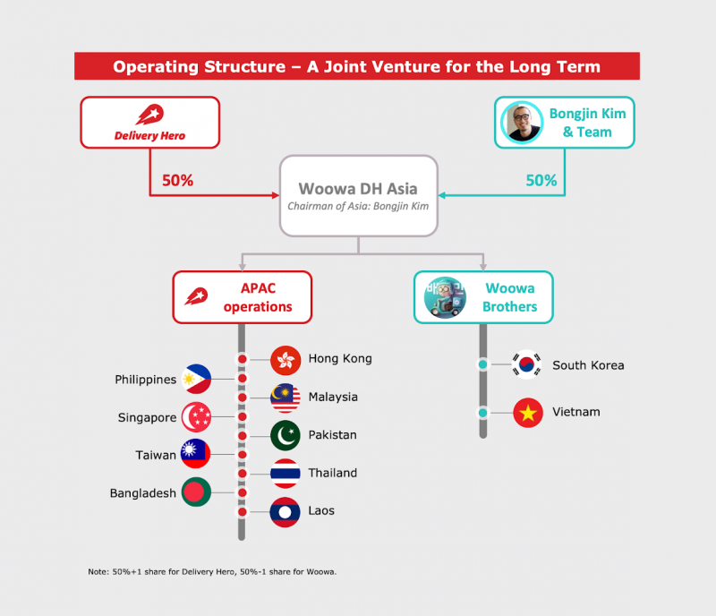

# 프리코스 - 회고



### 요즘 스타트업 업계에서 제일 핫한 이슈인 우아한형제들...!

에서 진행되는 개발자 양성 프로그램 [우아한테크코스](https://woowacourse.github.io/)(이하 우테코) 1차 전형을 붙고, 3주간 진행된 프리코스가 끝났다. 3주라는 기간은 사실 짧았지만, 그 짧은 기간동안 굉장히 많은 것을 배울 수 있었고 앞으로의 학습에 있어서도 좋은 밑거름이 되어서 이런 기회가 주어졌음에 사실 감사한 마음이 크다. 처음으로 이런 후기를 써보는데, 쓰는 김에 좀 더 멀리가서 스스로를 되돌아보았다.

### 난 우테코 신청하기 전 어떤 사람이었나

* **2017년**
  * 컴퓨터라곤 게임할 때랑 PPT 만들때밖에 써본적이 없는 평범한 경영학과 학생이었다.
  * 멋쟁이사자처럼이라는 동아리에서 HTML, CSS, JavaScript, Ruby, Ruby on Rails를 배우며 프로그래밍을 처음 배웠다. 제일 어려웠던 개념이 함수에서 `return`과 출력의 차이를 이해하는 것이었다.
  * 동아리, 그리고 교내에서 진행된 해커톤에 나가서 상을 탔다(!) 물론 나는 눈에 보이는 것들을 바꾸는데 더 흥미가 컸어서 주로 서버보단 클라이언트 개발에 많이 치중했다.
* **2018년**
  * 멋쟁이사자처럼에서 운영진으로서 내가 배웠던 것을 다른 학생들에게 가르쳤다. 가르치기 위해서 공부를 해야했다보니 전년에 비해서 훨씬 많은 양을 공부하느라 고생했었다.
  * 여름방학에 함께 공부하던 친구들과 스터디를 만들어 JavaScript 전반을 다시 공부하고 요즘 흔히 MERN 스택으로 불리는 React, Node.js, Express.js로 이루어진 풀스택 강의를 완강했다.
  * 친구들과 함께 만들었던 [드리머리](https://dreamary.net/)라는 스타트업에서 서비스 기획과 프론트엔드 개발을 맡게 되었다. 실제로 사용될 서비스를 만드는 것은 지금까지 교육을 위해서나 간단한 해커톤용 프로토타입을 만들 때와는 달리 신경써야할 것들이 더 많았다. 아무튼 친구들과 열심히 일해서 당시에 서비스를 만들었고, 지금은 개선된 버전으로 교체되었지만 그 당시에는 우리가 실제로 작동하는 프로덕트를 만들었다는 사실이 너무 감격스러웠다. 개발자로서 커리어를 처음으로 진지하게 생각한것도 이때 즈음이었다.
* **2019년**
  * 1학기를 휴학하고 멋쟁이사자처럼에서 직장인 교육 조교로 잠깐 일하게 되었다. 전년도와 비슷하게 기초 프로그래밍을 CS 비전공자들에게 가르치는 일이었다.
  * 과 선배가 대표로 있는 회사에서 잠깐 일해볼 것을 권유해주셔서 대학생들을 대상으로 하는 P2P 금융업인 [캠퍼스펀드](https://campusfund.net/) 서비스의 프론트엔드 개발을 맡았다. AngularJS로 만들어진 기존의 클라이언트의 기능 추가와 버그 픽스 등을 맡았다. 처음으로 팀 내 사수가 있었는데, 덕분에 코드를 작성하는데 있어 Git에 커밋을 남기는 방법이나 이를 수정하기 위한 interactive rebase 사용법을 비롯해 개발 외적으로도 클린 코드나 아키텍처의 중요성을 처음으로 배울 수 있는 기회였다.
  * 이제 슬슬 졸업이 다가오고 있어서 취업을 위해서 지금까지 주로 했던 JavaScript와 React를 비롯해 TypeScript, GraphQL, React Native 등에도 관심을 가지고 핀란드에서 교환학생으로 쉬는동안 공부를 하고 있었다.

### 우테코 프리코스에서 난 무엇을 배웠나

* **Java**
  * JavaScript와 Python 위주로 공부를 했다보니 사실 정말 우리나라의 "컴퓨터공학과"다운 언어 중 하나인 Java는 처음 접해본 것이었다. 이전에 쓰던 언어와 문법적으로는 비슷한 점이 많긴 했다. 하지만 정적 타이핑이 강제된다는 것, 모든 것을 클래스로 구현해야하는 것 등이 생소하게 다가오긴 했다. 이번에 만일 떨어지더라도 JavaScript 대신 TypeScript를 써야하는 좋은 이유가 생긴 것 같다.
  * 이전에는 클래스나 인스턴스에 대해 그렇게 싶은 생각을 해본 적이 없었는데, 짧은 메소드와 간결한 클래스 설계에 대해 고민하며 객체 지향에 대해서 가볍게라도 공부를 할 수 있었다.
*   **Human-readable한 코드 작성**

    * 요구사항 중에 처음에 제일 충격적이었던 것은 indent depth 제한을 두는 것이었다. 말 그대로 `for`문 안에 `if`문을 쓰지 못하게 하는 것이었는데, 처음에 든 생각은 "그럼 도대체 어떻게 짜라고?" 와 같은 막막함이었다. 그래서 일단 짱구를 굴려보며 이런저런 시도를 해보았다. 물론 훨씬 나은 대안들이 많겠지만, 우선은 내가 혼자 생각해보며 짠 코드는 다음과 같다.

    ```java
    private void askPlayer(Contender contender) {
        while (!contender.isBusted() && input.wantsMoreCard(contender.getName())) {
            contender.addCard(deck.draw());
            System.out.println(contender);
        }
    }

    private void askContenders() {
        for (Contender contender : contenders) {
            askPlayer(contender);
        }
        dealer.drawOneMoreFrom(deck);
    }
    ```

    * 원래는 `for`문 안에 `while` 문을 넣어야겠지만, 이런식으로 구현하면 작동방식이 같을지라도 한 눈에 코드들의 의미가 더 확실해진다.
    * 한 메소드당 10줄 이하 제한, 줄임말을 쓰지 않는 변수명 또는 메소드명 짓기, `int`와 같은 원시형 자료나 `String`을 하드코딩하지 않고 포장하기 등도 모두 같은 목적 하에서 요구된 사항들이었다.
* **팀으로 일하는 개발자의 마음가짐**
  * 사실 이건 앞의 Human-readable한 코드도 포함되는 내용인데, 지금까지 나는 주로 프로토타입이나 토이 프로젝트 수준의 개발을 많이하고 아무래도 그러다보니 혼자만이 읽을 수 있는(그마저도 지금은 아마 읽지 못할) 코드를 짜곤 했다. 그래서 GitHub에 남아있는 프로젝트들을 보면 사실 README.md 파일 하나 없는 경우도 많다.
  * 기능목록과 요구사항을 정리하고, 이에 맞춰 기능 단위별로 커밋을 한다는 것은 개인의 입장에선 번거로운 일이지만(물론 익숙치 않아서 처음에만 그럴 것이다), 팀으로 일한다는 입장을 생각하면 하나의 팀이 한 개인처럼 유기적으로 움직이는 것을 가능하게 만든다는 생각이 들었다.
  * 컨벤션을 엄격히 지키는 것, IDE나 에디터의 코드 포맷터를 사용하는 것, 유의미한 브랜치를 따는 것 등 코드의 내용 외적으로도 생각해야하는 것들이 많다고 느꼈다.
* **이 모든 것들을 혼자 공부할 수 있다는 자신감**
  * 사실 이번 프리코스의 1주차와 2주차 주제는 지난 기수 프리코스와 내용이 같았다. 그래서 미리 지난 기수의 코드들을 보며 공부를 했고, 요구사항들을 한 번에 정리해두고 구글링 하며 이에 관한 내용들을 찾아보았다.
  * 과제 제출을 할 때마다 1:1 피드백이 있는 것도 아니고, 코드 리뷰를 따로 받는 것도 아니었다.
  * 던져진 요구사항들에 대해 혼자 검색해보며 고민하고, 책이나 블로그를 찾아 읽어보는 이런 일련의 모든 과정들은 누가 시켜서 하는 것이 아니고, 나에게 절실하게 필요했기 때문에 주체적으로 공부할 수 있었다.
  * 이제 앞으로 어떤 공부를 하던지 **목적**과 **키워드** 정도만 있다면 앞으로 나갈 수 있을 거라는 자신감이 생겼다.
  * 향후에 다른 사람들을 가르칠 기회가 또 생긴다면 그 때도 이런 방법을 적용해보고 나만이 제공할 수 있는 커리큘럼과 길을 만들어보고 싶다.

### 이제 토요일에 시험을 보러 간다

처음에 단순히 빠르게 취직을 하고 싶다는 생각만으로 우테코를 비롯하여 여러 회사에 취직이나 교육 등을 알아보았고, 결국은 우테코 최종 테스트의 결과만 남겨두고 있는 상황이다. 10개월이라는 어떻게 보면 취준생 입장에서 굉장히 긴 시간을 써서 교육을 받는 것이 맞을까라는 고민을 했었다.

프리코스는 끝이 났고, 이제 본 과정 입과는 솔직히 떨어져도 붙어도 상관은 없다.(물론 붙으면 기쁘겠지) 3주간의 프리코스 동안 앞으로 어떤 공부를 어떻게 해야할지, 어떤 생각을 가지고 프로그래밍에 임해야하는지를 간략하게라도 배울 수 있었다. 또한 프로그래밍을 독학하며 배운 "무작정 돌아가는 코드"를 작성하던 버릇을 버린 것만 해도 너무나도 큰 자산을 얻었다.

### 누군가 다음 우테코에 지원할 것이라면

꼭 하길 추천한다. 특히 나처럼 비전공자로서 대학에서 CS/CE 과정을 아예 들어보지 않았던 사람이라면 더더욱 추천한다. 본 과정에 입과하지 않아 앞으로의 일정이나 교육에 대해선 어떻게 될진 모르겠지만, 프리코스만 들어도 많은 것을 얻을 수 있다는 것은 보장할 수 있다.

> 박재성님을 비롯한 우아한테크코스 담당자 분들께 다시 한 번 진심으로 감사드립니다 :)
